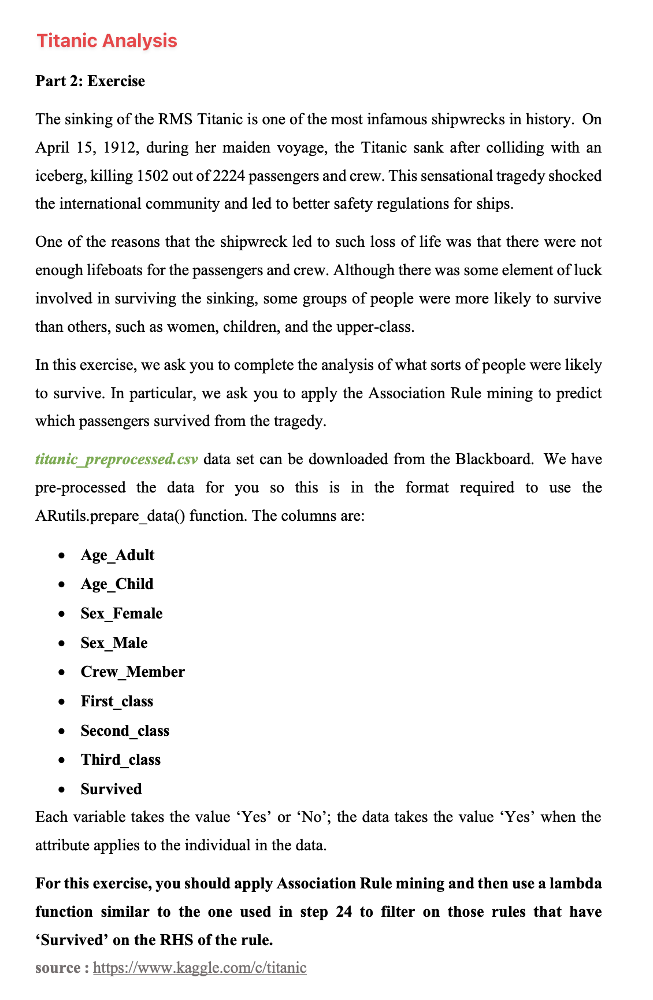

# AI MSc Project

## Virtual env workflow

```bash
# Install virtualenv
python3 -m pip install —-user virtualenv
```

```bash
# Create new virtual environment
python3 -m virtualenv env_name
```

```bash
# Activate the Virtual Environment
source env_name/bin/activate
```

```bash
# Install Jupyter Notebook
pip3 install jupyterlab notebook
```

```bash
# Create a Jupyter Kernel
python3 -m ipykernel install —-user —-name=env
```

```bash
# Start Jupyter Notebook
jupyter notebook
```

```bash
# Deactivate the Virtual Environment
source env_name/bin/deactivate
```

## [Titanic Survival Analysis](./MLDM%20-%20Titanic%20Survivor%20Analysis.ipynb)


